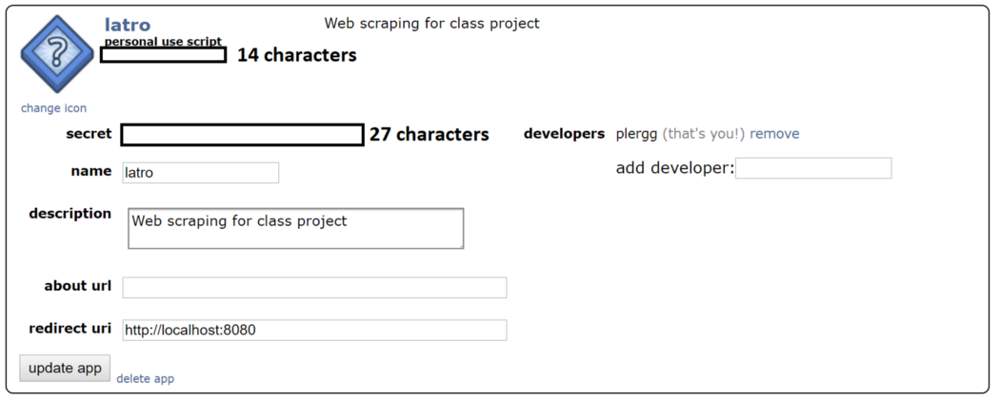

# :zap: Reddit Scraper

This script will allow one to scrape images from a Reddit subreddit
using the The Python Reddit API wrapper. It is a work in progress,
and more options will be available beyond pulling images, as I continue 
development on this project.

## :bulb: Instructions

To successfully use this script to pull images you will need to do the following:

1. Log into your Reddit account.
2. Click the down arrow to the right of your name, then click the Preferences button.
3. Click the app tab.
4. Populate your script with the required fields. Refer to the screen shot below:

1. Use the [*secrets-json*](secrets.json) to populate the following fields:
   * client_id
   * client_secret
   * user_agent (AKA the name of the app)

2. user the [*refreshtoken.py](refreshtoken.py) script to obtain a refresh token, and append it to the refresh_token key, in the secrets.json
3. Hide the secret.json file by renaming the file to *.secrets.json*

4.  import all of the Python libraries contained in the requirements.txt file, the [*reddit_pkg*](reddit_pkg/) directory.

## :bulb: Running the script:

The program is run via the main.py script.
It will ask the user to enter the name of the subbreddit, validate that it exists, then pull the top 10 images from *hot* category if 
it contains a valid image file name.
